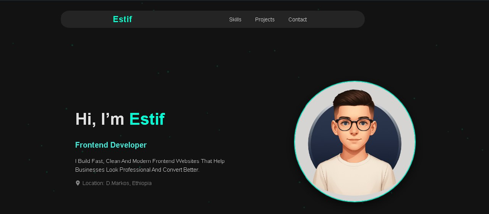

# Estif – Frontend Developer Portfolio

Personal portfolio website showcasing selected frontend projects, skills, and contact information.

---

## Overview

This portfolio website was built to present my frontend development work in a clean and professional way.

It highlights selected real-world style projects, core technologies I use, and provides a direct way to get in touch for freelance work or collaborations.

The design focuses on:

- Minimal and modern UI
- Strong visual hierarchy
- Clear project presentation
- Responsive layout
- Performance and simplicity

---

## Tech Stack

- HTML5
- CSS3
- JavaScript
- React (if used)
- Git & GitHub

---

## Installation

Clone the repository:

git clone https://github.com/code-Estif/My-portfolio.git

cd My-portfolio  
npm install  
npm run dev  

---

## About Me

I’m Estif, a frontend developer focused on building fast, clean and modern websites using HTML, CSS, JavaScript and React.

Based in Debre Markos, Ethiopia.  
Available for freelance frontend projects and long-term collaborations.

---

## Contact

If you're interested in working together:
 
LinkedIn: https://www.linkedin.com/in/estif-dev-962531375/ 

GitHub: https://github.com/code-Estif
